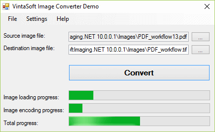

# VintaSoft WinForms Image Converter Demo

This C# project uses <a href="https://www.vintasoft.com/vsimaging-dotnet-index.html">VintaSoft Imaging .NET SDK</a> and demonstrates how to convert images and documents:
* Convert all supported image and document file formats back and forth.
* Progress indicating: image loading/encoding, total. 
* Input file format: BMP, DICOM, DOC, DOCX, XLS, XLSX, EMF, GIF, Icon, JBIG2, JPEG, JPEG-LS, JPEG2000, PBM, PCX, PDF, PNG,  RAW, TGA, TIFF, WMF, WEBP(.NET Core 3.1 or higher).
* Output file format: BMP, DOCX (only for DOC), XLSX (only for XLS), GIF, JBIG2, JPEG, JPEG2000, PBM, PCX, PDF, PNG, SVG, TGA, TIFF, WEBP(.NET Core 3.1 or higher).


## Screenshot



## Usage
1. Get the 30 day free evaluation license for <a href="https://www.vintasoft.com/vsimaging-dotnet-index.html" target="_blank">VintaSoft Imaging .NET SDK</a> as described here: <a href="https://www.vintasoft.com/docs/vsimaging-dotnet/Licensing-Evaluation.html" target="_blank">https://www.vintasoft.com/docs/vsimaging-dotnet/Licensing-Evaluation.html</a>

2. Update the evaluation license in "CSharp\MainForm.cs" file:
   ```
   Vintasoft.Imaging.ImagingGlobalSettings.Register("REG_USER", "REG_EMAIL", "EXPIRATION_DATE", "REG_CODE");
   ```

3. Build the project ("ImageConverterDemo.Net10.csproj" file) in Visual Studio or using .NET CLI:
   ```
   dotnet build ImageConverterDemo.Net10.csproj
   ```

4. Run compiled application and try to convert images and documents.


## Documentation
VintaSoft Imaging .NET SDK on-line User Guide and API Reference for .NET developer is available here: https://www.vintasoft.com/docs/vsimaging-dotnet/


## Support
Please visit our <a href="https://myaccount.vintasoft.com/">online support center</a> if you have any question or problem.
